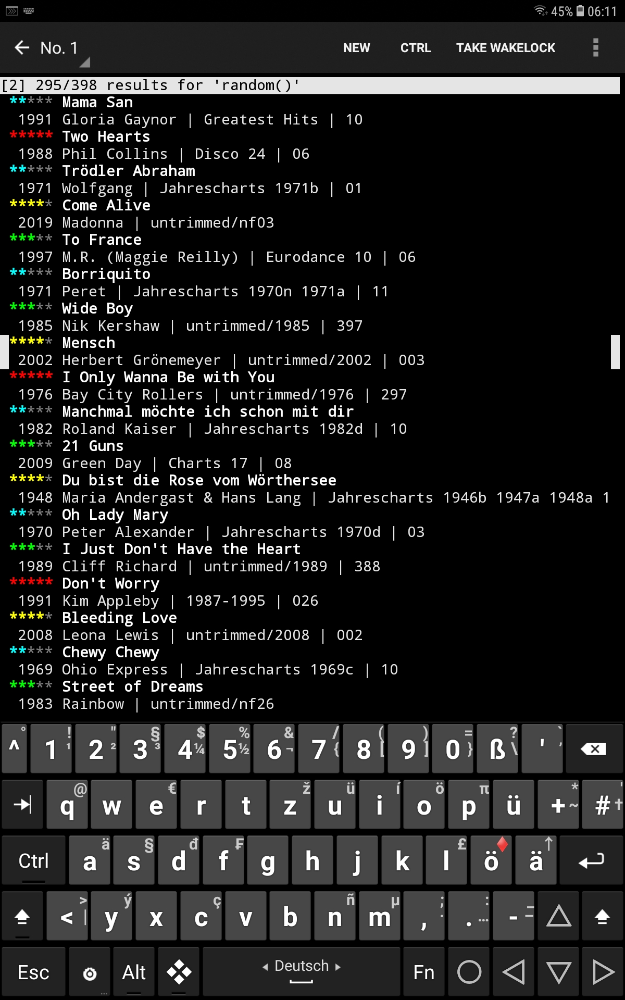

# Music

License is CC0. Runs on QPython 3L on my Android tablet while VLC is playing in the background. Provides 5 star ratings for each song with a single keypress [+] or [–]. Has a ToDo field for each song with the key [t] so that when the song is playing and I notice a bug, I can just quickly type in a few words to mark that song and fix it later on the master archive. This means that there will never be a consistency problem in my music collection because all changes will be made on the master archive. There are also no problems with wrong ID3Tags as Music.py will create them on the fly from file paths while copying a new bunch of songs for VLC from the master archive.

